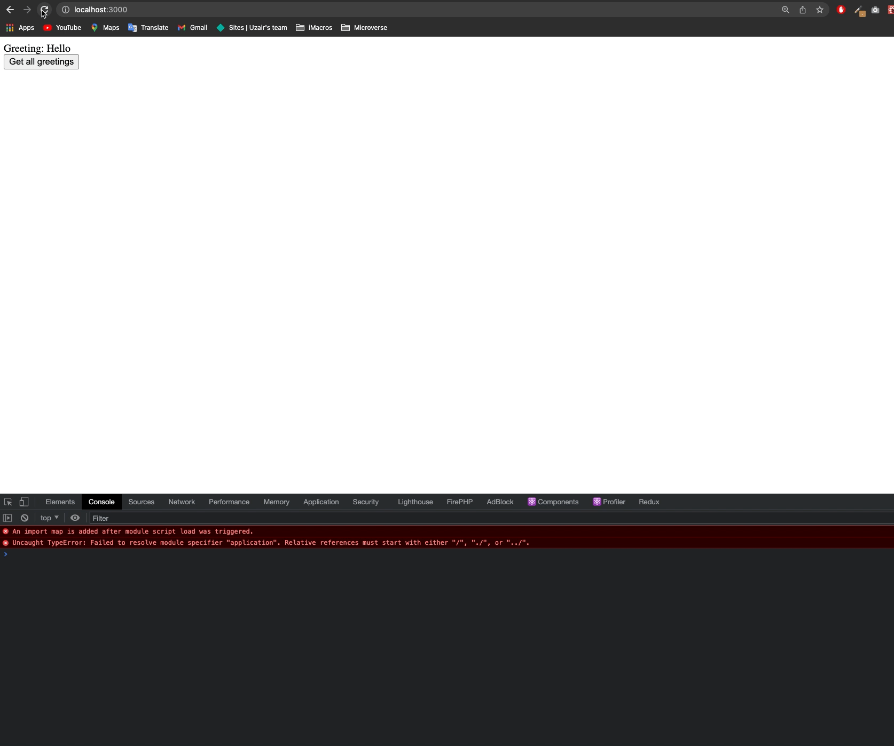

# Space Travelers

> This app uses `Rails` and sets up the `React` in the front-end. It further takes the `Redux` library and sets up a dummy backend server to check if the react app is able to communicate with the rails backend server.

## Demo



## Built With

- Javascript
- HTML
- CSS
- React
- React Router Dom
- Redux
- Rails
- Webpacker

## Getting Started

To get a local copy up and running follow these simple example steps.


### Setup

```bash
# To clone the git repositories
git clone https://github.com/uzairali19/react-hello-rails.git

# To install React dependencies
yarn

# To install Rails
bundle

# To create the database
rails db:create

# To migrate to database
rails db:migrate

# To seed the data
rake db:migrate db:seed

# Finally To run development branch
rails s
```
***Please make sure to follow them in exact order***

### Run tests

For Linters:

```bash
# To check for errors
yarn lint
```

## Author

👤 **Uzair Ali**

- GitHub: [@uzairali19](https://github.com/uzairali19)
- Twitter: [@uzairali751](https://twitter.com/Uzairali751)
- LinkedIn: [Uzair Ali](https://www.linkedin.com/in/uzair-ali-9641/)

## 🤝 Contributing

Contributions, issues, and feature requests are welcome!

Feel free to check the [issues page](https://github.com/uzairali19/react-hello-rails/issues/).

## Show your support

Give a ⭐️ if you like this project!

## 📝 License

This project is [MIT](./MIT.md) licensed.
